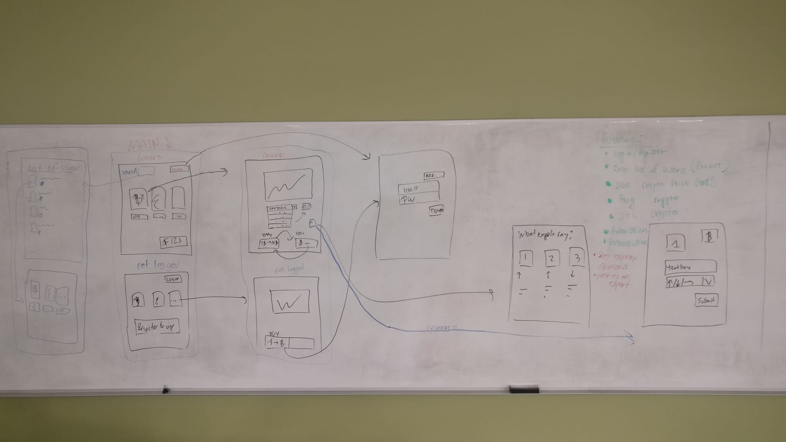

## Crypto - Currency Exchange
### What is this?
Crypto - Exchange is the final project for CSCI 3342 Internet Programming Fall 2019 at the University of Texas Rio Grande Valley. The project members are: <B>Ricardo Carrillo, Alvaro Rios, and Marc Barrera Fuente.</B> 

Simply put, this is a web app that allows login/register of users with authentication and authorization if you are an "expert" user with the main functionality being the mock buying and selling of the 3 leading cryptocurrencies, namely, Bitcoin, Ethereum, and Litecoin. 

The app's main page includes price (in USD) and metric page navigations for each coin as well as the option to sign in/ register. 

The second page is reached after logging in/ registering from the main page and includes how much you, the user, has in his or her wallet as well as buttons (TODO). The web app also has a page to see the current list of all users (including expert users) and another page to see the 3 most recent "expert opinions" of the expert users . Consequently, the app also has a page exclusive to expert users that allows them to create posts of their opinions on the 3 coins featured in the app. 

### Frontend: 
HTML/CSS/JS with Bootstrap 

### Backend:
Node.js, Express server with Handlebars for server generated HTML view engine, and SQL database with ORM implemented with Sequalize

### Design and Site Architechture from initial brainstorming session
BrainStorm Session 1 Site Overview: 
BrainStorm Session 1 Main Page: 
BrainStorm Session 1 List of Users Page: 
BrainStorm Session 1 Crypto Metrics Page: 
BrainStorm Session 1 Expert Opinions Page: 
BrainStorm Session 1 Expert Post Page: 
BrainStorm Session 1 Database Architechture: 
